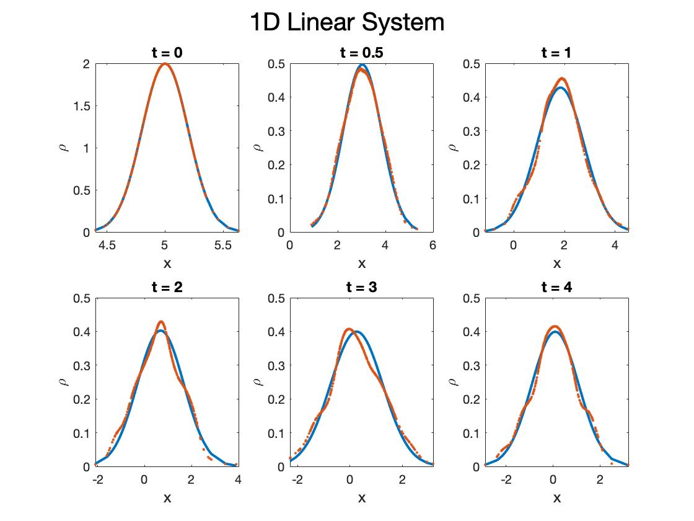
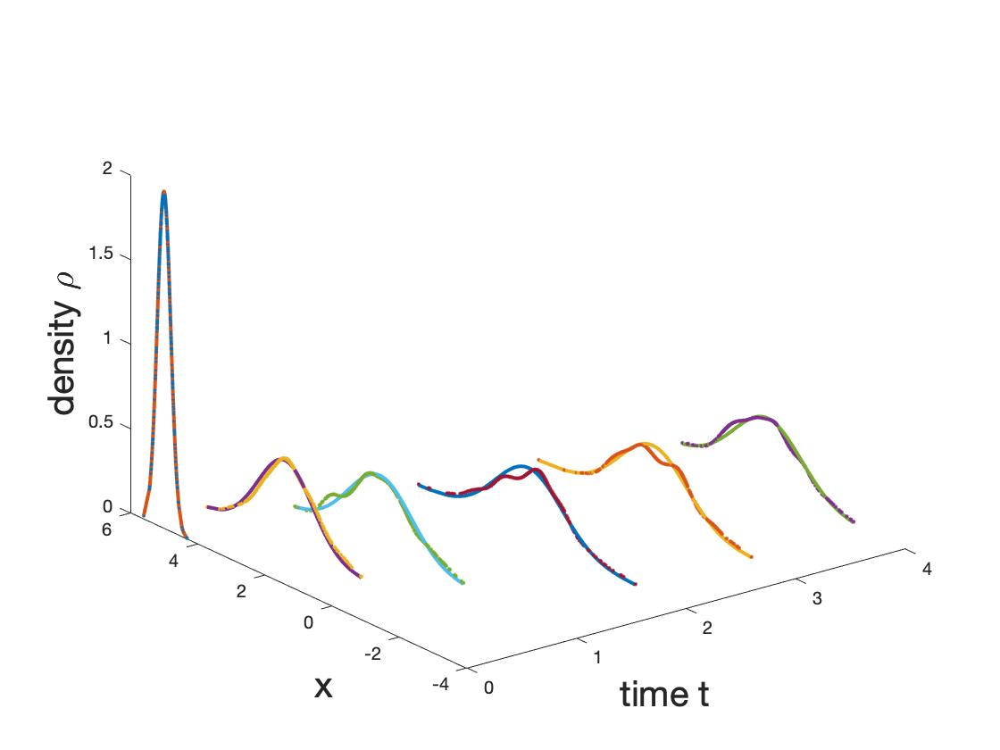
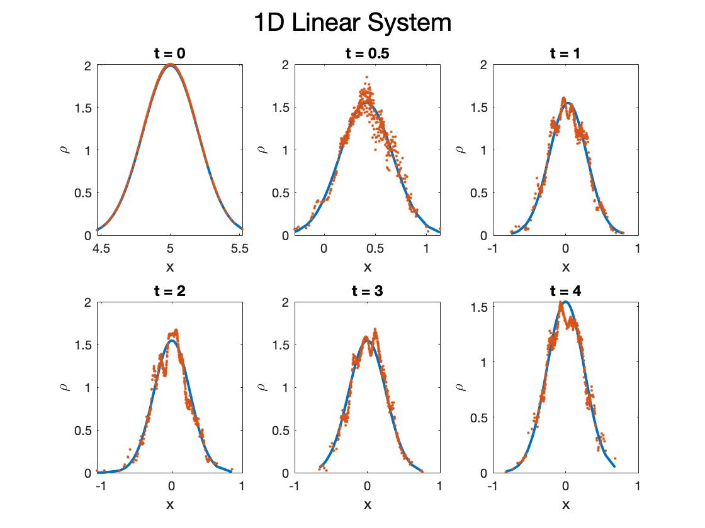
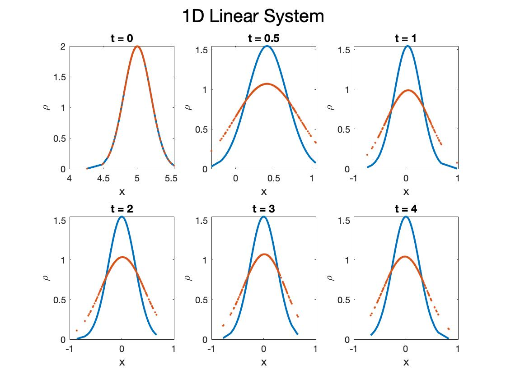

# User Guide

## Introduction 

This is a Fokker-Planck-Kolmogorov PDE solver for 1D Ornstein Uhlenbeck System and 
a 2D Potential Nonlinear System.

**NOTE**: This solver only supports the above systems currently. There is on-going work on applications to more general systems.


## Example:

These are sample plots for a 1D system. The required inputs are explained below in further detail.
The User is can go through the main executable file Main.m to see the entire file in detail and change some of the inputs and parameters.

 
The first figure creates 6 subplots of the transient PDFs at different time specified by the user. 


The second figure compares the analytical mean with the numerical mean.


The third figure compares the analytical variance with the numerical variance.


The last figure plots the transients in one plot. 


## Required Inputs from the User:

All parameters are dimensionless. 

1. *dim*: Determines the spatial dimension of the system of interest. In this case, input should be  either 1 or 2.  

    ```matlab
    dim = 1
    ```
 2. *beta*: The diffusion coefficient which determines the strength of the noise/randomness added to the system.
  
  ```matlab
    beta  = 1
  ```
 
 3. *nSample*: The number of PDF point values to be plotted. Typical values for good visualization should be chosen to be in 200-500 range. In the example above, we choose *nSample* = 400.
 
  ```matlab 
    nSample = 400 
  ```
 4. *alpha*: The drift coefficient which determines the strength of the drift/deterministic part of the system.
 
 ```matlab 
    alpha = 1
  ```
 5. *epsilon*: The regularization coefficient which "smooths" out the solutions. Suggested values are 
 *epsilon* = 0.001-0.1 range depending on the other parameters above.
 
 ```matlab 
    epsilon = .01
 ```
Here is an example of *epsilon* chosen to be too small. 
 

 
 Here is an example of *epsilon* chosen to be too big. 
 
 
 
 6. *h*: Time step for underlying dynamics. 

  ```matlab 
    h = .001
 ```
 
 7.  *t_initial*,*t_final*: Initial and final times of the dynamics, respectively.
   ```matlab 
     t_initial = 0;                                      
     t_final = 4 ;
   ```
  8. *x0*: A *(nSample x dim)* matrix of initial position values. For 1D Ornstein-Uhlenbeck case, the *(nSample x dim)* vector *x0* must be normally distributed and can be generated as follows: 
  
  ```matlab
   mean0 = 5 		% initial mean
   
   sigma0 =  .2     	% initial standard deviation
 
   x0 = normrnd(mean0,sigma0,nSample,dim) 		% generates initial positions 
 ```
  
 8. *rho_0*: An *(nSample x 1)* vector of initial PDF values. For the 1D case, *rho_0* must be normally distributed sample and can be generated from the previously generated position samples as follows: 
 
   ```matlab 
 rho_0 = normpdf(x0,mean0,sigma0) 			% generates initial value PDF
   ```
**NOTE**: For convenience, in the  2D Nonlinear System, we can choose multivariate Gaussian sample points and PDF value. We can do this in MATLAB using the commands:

   ```matlab 
 mean0 =  [2,2]	   		% initial mean vector
 
 sigma0 = 4*eye(dim) 	% initial covariance matrix 
 
 rho_0 = mvnpdf(x0, mean0,sigma0) 	% generates (nSample x 1) vector of PDF values 
   ```

